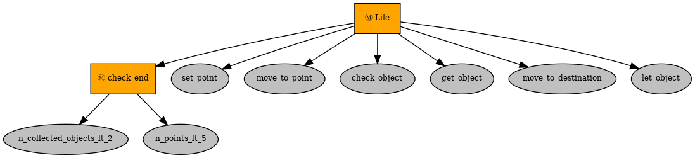
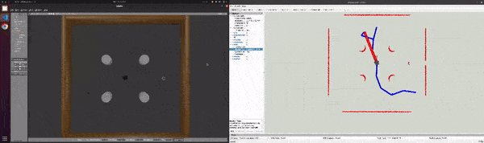

# "Pickup objects" task using behavior trees in ROS

This repository encompasses the implementation of a behavior trees node in ROS for a turtlebot3 platform in ROS noetic Gazebo to complete an object collecting task. This work is developed as a component of Lab 02 for the Hands-on Planning course offered by IFROS.

## Contributors

- Atharva A. Patwe
- Loc Thanh Pham

## Instructor

- Dr. Narcis Palomeras Rovira

## Date

March 11, 2024

## Introduction

This repository hosts the codebase for a pickup behaviors tree node designed in ROS, crafted as a requisite for the Hands-on Planning course at IFROS. This project utilizes the [py_trees](https://github.com/splintered-reality/py_trees) library.

Using these behavior tree, we implement the following task.

The robot has to navigate to a list of points and in each one it has to check if there is an object on it. If there is an object, it picks it up and takes it to `(-1.5, -1.5)` if the object was a `beer` can or to `(1.5, 1.5)` if the object was a `coke` can. Once there, the robot leaves the object and goes to the next point. The task ends once two objects have been collected or all provided points have been explored. The points where the objects can be found are:

* (1.25, 0.5)
* (1.25, -1.25)
* (0.0, -1.25)
* (-0.5, 1.25)
* (-1.25, 0.5)

This package is developed and tested in ROS Noetic on Ubuntu 20.04 machines.


## Setting up

### Prerequisites
This lab uses the [py_trees](https://github.com/splintered-reality/py_trees) library.
To install the `py_trees` library do:

```bash
pip install py_trees
```

To implement the pick up objects task package perform following steps:
1. Install all the turtlebot packages from [here](https://emanual.robotis.com/docs/en/platform/turtlebot3/simulation/#gazebo-simulation)
2. Clone this repository as a package in the src folder
3. Build the catkin workspace : ```catkin build``` or ```catkin_make```
4. Source the setup.bash file: ```source devel\setup.bash```
5. Export turtlebot model: ```export TURTLEBOT3_MODEL=burger```

Task 1: Free map without obstacles
1. Launch the pick up objects task 1 launch file present in the launch folder: ```roslaunch pick_up_objects_task pick_up_objects_task_1.launch```
2. Run the pickup_behaviors_node.py file: ```rosrun pick_up_objects_task pickup_behaviors_node.py```

Task 2: Map with obstacles (with the path planning controller that running RRT algorithm to find path)
1. Clone repository `turtlebot_online_path_planning` from [here](https://github.com/LeoPhamVN/turtlebot_online_path_planning.git) as a package in the src folder.
2. Launch the pick up objects task 2 launch file present in the launch folder: ```roslaunch pick_up_objects_task pick_up_objects_task_2.launch```
3. Run the pickup_behaviors_node.py file: ```rosrun pick_up_objects_task pickup_behaviors_node.py```


**To Visualise the Tree, Path other markers, add the markers in rviz**

## Implementation 

The code is organized mainly in three files the [ROS Node](src/pickup_behaviors_node) file, [manage objects helper file](src/manage_objects_node.py) and [turtlebot controller helper file](src/turtlebot_controller_node.py)

### Planning Objective
The main goal of this project is to develop a behavior tree planning a sequence of behaviors need to be done to achieve the picking objects task. The Pick up behaviors node, developed for this purpose.

This behavior tree has following behaviors:



### Check number of points less than N_points (length of points list)

It checks the number of points in the list, which were travelled to by the robot. If it is less than N_points, the behavior return `True`. Meanwhile, if it is equal or greater than N_points, return `False`. 

### Check number of collected objects less than N_objects (number of objects on the map)

It checks the number of collected objects. If it is less than N_objects, the behavior return `True`. Meanwhile, if it is equal or greater than N_objects, return `False`.

### Set Point

This behavior sets the next point location the robot need to travel to based on number of points the robot already went to. The robot goes to each point in the list sequencely. Then, number of travelled points will increase one. Finally, return `True`. 

### Move to Point

The robot move to the point *x*, *y* location in the point list. This behavior is provided by the node [pickup_behavior_node.py](./src/pickup_behaviors_node.py) from this package. To be more specific, this behavior publishes the *x*, *y* location, then compares subcribed position of the robot to the target position as an ending condition. If this distance is less than 0.35, return `True`, otherwise, return `False`.

### Check Object

This behavior runs a service `check_object` provided by the [manage_objects_node.py](./src/manage_objects_node.py). It returns `False` if no object is close to the robot and `True` plus the object's name if an object is close to it. If it returns `True`, number of collected objects will increase 1.

### Get Object

This behavior run a service `get_object` provided by the [manage_objects_node.py](./src/manage_objects_node.py). It returns `False` if no object is close to the robot and `True` if an object is close to it. It also moves this object over the robot.

### Move to Destination

The robot move to the destination *x*, *y* location, where robot will leave object and depends on object type. This behavior is provided by the node [pickup_behavior_node.py](./src/pickup_behaviors_node.py) from this package. To be more specific, this behavior publishes the *x*, *y* location, then compares subcribed position of the robot to the target position as an ending condition. If this distance is less than 0.35, return `True`, otherwise, return `False`.

### Let Object
This behavior run a service `let_object` provided by the [manage_objects_node.py](./src/manage_objects_node.py). It returns `False` if no object is over the robot and `True` if an object is over it. It also moves this object to the floor.

## Overall Contribution

The overall contributions of this work can be summarized as follows:

* Behavior tree

## Limitations and Scope for improvements


1. ...


## Demonstration

A video showing the working of the behavior tree is showed below.



